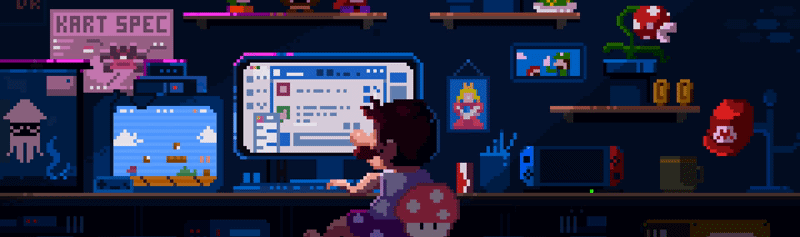

  

<h1>Olá, meu nome é Nathalia!</h1>

<h3>Desenvolvedora Web</h3>

Desenvolvedora com experiência na construção de aplicações web e mobile modernas, intuitivas e de alto desempenho. Apaixonada por criar soluções completas, do backend bem estruturado a interfaces de usuário refinadas e responsivas. Atualmente atuando no desenvolvimento de sistemas web, soluções mobile e aperfeiçoamento na área.

  
  
  

<h2> Tecnologias</h2>

<h3>Front-end</h3>

<h3>Back-end</h3>

<h3>Tools</h3>

 

<h2 align="left">
  
  GitHub
</h2>

  

