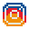

```aura width=860 height=220
<div style={{
  width: '100%', height: '100%', display: 'flex', position: 'relative',
  overflow: 'hidden', borderRadius: 18, background: '#080d18',
  border: '1px solid rgba(255,107,157,0.18)', fontFamily: 'Inter',
}}>
  <style>{`
    @keyframes drift-a { 0%, 100% { transform: translateX(0px); opacity: .85; } 50% { transform: translateX(180px); opacity: 1; } }
    @keyframes drift-b { 0%, 100% { transform: translateX(0px); opacity: .7; } 50% { transform: translateX(-220px); opacity: 1; } }
    @keyframes drift-c { 0%, 100% { transform: translateX(0px); opacity: .6; } 50% { transform: translateX(260px); opacity: .95; } }
    @keyframes breathe { 0%, 100% { transform: scale(1); opacity: .75; } 50% { transform: scale(1.25); opacity: .45; } }
    @keyframes blink   { 0%, 45% { opacity: 1; } 50%, 95% { opacity: .15; } 100% { opacity: 1; } }
    #aura-1 { animation: drift-a 11s ease-in-out infinite; }
    #aura-2 { animation: drift-b 14s ease-in-out infinite; }
    #aura-3 { animation: drift-c 9s  ease-in-out infinite; }
    #aura-4 { animation: breathe 7s  ease-in-out infinite; }
    #aura-5 { animation: drift-a 16s ease-in-out infinite reverse; }
    #cursor { animation: blink 1.2s steps(1) infinite; }
  `}</style>

  <svg width="860" height="220" style={{ position: 'absolute', top: 0, left: 0 }}>
    <defs>
      <radialGradient id="p1" cx="50%" cy="50%" r="50%">
        <stop offset="0%" stopColor="rgba(224,69,123,0.60)" />
        <stop offset="45%" stopColor="rgba(200,50,110,0.24)" />
        <stop offset="72%" stopColor="rgba(200,50,110,0)" />
      </radialGradient>
      <radialGradient id="p2" cx="50%" cy="50%" r="50%">
        <stop offset="0%" stopColor="rgba(120,60,220,0.50)" />
        <stop offset="50%" stopColor="rgba(90,40,190,0.18)" />
        <stop offset="72%" stopColor="rgba(90,40,190,0)" />
      </radialGradient>
      <radialGradient id="p3" cx="50%" cy="50%" r="50%">
        <stop offset="0%" stopColor="rgba(74,159,216,0.42)" />
        <stop offset="50%" stopColor="rgba(45,111,184,0.16)" />
        <stop offset="72%" stopColor="rgba(45,111,184,0)" />
      </radialGradient>
      <radialGradient id="p4" cx="50%" cy="50%" r="50%">
        <stop offset="0%" stopColor="rgba(255,107,157,0.38)" />
        <stop offset="70%" stopColor="rgba(255,107,157,0)" />
      </radialGradient>
      <pattern id="scan" width="3" height="3" patternUnits="userSpaceOnUse">
        <rect width="3" height="1" fill="rgba(255,255,255,0.030)" />
      </pattern>
    </defs>

    <ellipse id="aura-1" cx="170" cy="230" rx="250" ry="180" fill="url(#p1)" />
    <ellipse id="aura-2" cx="430" cy="245" rx="230" ry="165" fill="url(#p2)" />
    <ellipse id="aura-3" cx="300" cy="235" rx="190" ry="150" fill="url(#p3)" />
    <ellipse id="aura-4" cx="640" cy="250" rx="160" ry="130" fill="url(#p4)" />
    <ellipse id="aura-5" cx="760" cy="240" rx="150" ry="125" fill="url(#p1)" />
    <rect x="0" y="0" width="860" height="220" fill="url(#scan)" />
    <rect id="cursor" x="321" y="54" width="8" height="14" fill="#ff6b9d" />
  </svg>

  <div style={{
    position: 'absolute', left: 44, top: 54, width: 112, height: 112,
    borderRadius: 56, display: 'flex', alignItems: 'center', justifyContent: 'center',
    background: 'linear-gradient(135deg, #ff6b9d, #7b3ce0 55%, #4a9fd8)',
  }}>
    
  </div>

  <div style={{ display: 'flex', flexDirection: 'column', marginLeft: 184, marginTop: 52, gap: 9 }}>
    <div style={{ display: 'flex', alignItems: 'center', gap: 8 }}>
      <div style={{ display: 'flex', fontSize: 13, fontWeight: 700, color: '#ff6b9d', letterSpacing: '2.4px' }}>
        OLÁ, EU SOU A
      </div>
    </div>

    <div style={{ display: 'flex', fontSize: 36, fontWeight: 700, color: '#ffffff', letterSpacing: '-1.2px', lineHeight: 1 }}>
      {github?.user?.name ?? 'Nathalia Mariano Lopes'}
    </div>

    <div style={{ display: 'flex', fontSize: 15, color: 'rgba(233,214,235,0.72)' }}>
      Desenvolvedora Full Stack e Mobile · Análise e Desenvolvimento de Sistemas
    </div>

    <div style={{ display: 'flex', gap: 8, marginTop: 6 }}>
      {[
        { label: github?.user?.location ?? 'Ji-Paraná, RO', color: '#ff6b9d' },
        { label: (github?.user?.company ?? '@uniinternet').trim(), color: '#4a9fd8' },
        { label: 'Codando desde ' + new Date(github?.user?.createdAt ?? '2022-03-07').getFullYear(), color: '#c084fc' },
      ].map(function (chip, i) {
        return (
          <div key={i} style={{
            display: 'flex', alignItems: 'center', gap: 7, padding: '5px 13px', borderRadius: 20,
            background: 'rgba(255,255,255,0.05)', border: '1px solid rgba(255,255,255,0.10)',
          }}>
            <div style={{ display: 'flex', width: 7, height: 7, borderRadius: 4, background: chip.color }} />
            <div style={{ display: 'flex', fontSize: 12, fontWeight: 700, color: 'rgba(240,232,245,0.86)' }}>{chip.label}</div>
          </div>
        );
      })}
    </div>
  </div>
</div>
```

```aura width=176 height=54 link="https://www.linkedin.com/in/nnathallia/" inline align=center
<div style={{ width: '100%', height: '100%', display: 'flex', alignItems: 'center', justifyContent: 'center', fontFamily: 'Inter' }}>
  <div style={{
    display: 'flex', alignItems: 'center', gap: 10, height: 42, paddingLeft: 18, paddingRight: 18,
    borderRadius: 21, background: '#0d1424', border: '1px solid rgba(74,159,216,0.45)',
  }}>
    
    <div style={{ display: 'flex', fontSize: 13, fontWeight: 700, color: '#eef2f9' }}>LinkedIn</div>
  </div>
</div>
```
```aura width=166 height=54 link="mailto:contato.lopesnnathallia@gmail.com" inline align=center
<div style={{ width: '100%', height: '100%', display: 'flex', alignItems: 'center', justifyContent: 'center', fontFamily: 'Inter' }}>
  <div style={{
    display: 'flex', alignItems: 'center', gap: 10, height: 42, paddingLeft: 18, paddingRight: 18,
    borderRadius: 21, background: '#0d1424', border: '1px solid rgba(234,67,53,0.45)',
  }}>
    
    <div style={{ display: 'flex', fontSize: 13, fontWeight: 700, color: '#eef2f9' }}>E-mail</div>
  </div>
</div>
```
```aura width=186 height=54 link="https://instagram.com/_nnathallia" inline align=center
<div style={{ width: '100%', height: '100%', display: 'flex', alignItems: 'center', justifyContent: 'center', fontFamily: 'Inter' }}>
  <div style={{
    display: 'flex', alignItems: 'center', gap: 10, height: 42, paddingLeft: 18, paddingRight: 18,
    borderRadius: 21, background: '#0d1424', border: '1px solid rgba(255,107,157,0.50)',
  }}>
    
    <div style={{ display: 'flex', fontSize: 13, fontWeight: 700, color: '#eef2f9' }}>Instagram</div>
  </div>
</div>
```

```aura width=860 height=150
<div style={{
  width: '100%', height: '100%', display: 'flex', flexDirection: 'column', justifyContent: 'center',
  borderRadius: 18, padding: 26, background: '#0a1020',
  border: '1px solid rgba(255,255,255,0.07)', fontFamily: 'Inter',
}}>
  <div style={{ display: 'flex', alignItems: 'center', gap: 10, marginBottom: 12 }}>
    <div style={{ display: 'flex', width: 4, height: 18, borderRadius: 2, background: '#ff6b9d' }} />
    <div style={{ display: 'flex', fontSize: 17, fontWeight: 700, color: '#ffffff', letterSpacing: '-0.3px' }}>Sobre mim</div>
  </div>
  <div style={{ display: 'flex', fontSize: 14.5, lineHeight: 1.65, color: 'rgba(226,214,235,0.74)', width: 790 }}>
    Desenvolvedora com experiência na construção de aplicações web e mobile modernas, intuitivas e de alto desempenho.
    Apaixonada por criar soluções completas, do backend bem estruturado a interfaces refinadas e responsivas.
    Atualmente atuando no desenvolvimento de sistemas web e soluções mobile.
  </div>
</div>
```

```aura width=860 height=508
<div style={{
  width: '100%', height: '100%', display: 'flex', position: 'relative', overflow: 'hidden',
  borderRadius: 18, padding: 26, background: '#0a1020',
  border: '1px solid rgba(255,255,255,0.07)', fontFamily: 'Inter',
}}>
  <div style={{ display: 'flex', flexDirection: 'column', width: 808 }}>
    <div style={{ display: 'flex', alignItems: 'center', gap: 10, marginBottom: 20 }}>
      <div style={{ display: 'flex', width: 4, height: 18, borderRadius: 2, background: '#4a9fd8' }} />
      <div style={{ display: 'flex', fontSize: 17, fontWeight: 700, color: '#ffffff', letterSpacing: '-0.3px' }}>Tecnologias</div>
    </div>

    {[
      { group: 'LINGUAGENS', w: 622, items: [
        { name: 'TypeScript', color: '#3178c6' },
        { name: 'JavaScript', color: '#f7df1e' },
        { name: 'SQL', color: '#e38c00' },
        { name: 'Python', color: '#3570ad' },
      ] },
      { group: 'FRONTEND', w: 622, items: [
        { name: 'React', color: '#61dafb' },
        { name: 'Next.js', color: '#e6e6e6' },
        { name: 'Tailwind CSS', color: '#38bdf8' },
        { name: 'Bootstrap', color: '#38bdf8' },
        { name: 'shadcn/ui', color: '#d4d4d8' },
        { name: 'React Hook Form', color: '#ec5990' },
        { name: 'Zod', color: '#4a7fd4' },
      ] },
      { group: 'BACKEND', w: 622, items: [
        { name: 'Node.js', color: '#5fa04e' },
        { name: 'NestJS', color: '#e0234e' },
        { name: 'Django', color: '#44b78b' },
        { name: 'REST', color: '#7dd3fc' },
      ] },
      { group: 'DADOS', w: 622, items: [
        { name: 'PostgreSQL', color: '#4a90c4' },
        { name: 'MySQL', color: '#00758f' },
        { name: 'SQLite', color: '#7cc4e8' },
        { name: 'MongoDB', color: '#47a248' },
        { name: 'Prisma', color: '#7c8cf8' },
        { name: 'Drizzle ORM', color: '#c5f74f' },
      ] },
      { group: 'MOBILE', w: 622, items: [
        { name: 'React Native', color: '#61dafb' },
        { name: 'Expo', color: '#e6e6e6' },
      ] },
      { group: 'ENGENHARIA', w: 622, items: [
        { name: 'Git', color: '#f05032' },
        { name: 'Docker', color: '#2496ed' },
        { name: 'GitHub Actions', color: '#2088ff' },
      ] },
    ].map(function (row, r) {
      return (
        <div key={r} style={{ display: 'flex', flexDirection: 'column', gap: 9, marginBottom: 14 }}>
          <div style={{ display: 'flex', fontSize: 10.5, fontWeight: 700, color: 'rgba(255,107,157,0.85)', letterSpacing: '1.8px' }}>
            {row.group}
          </div>
          <div style={{ display: 'flex', flexWrap: 'wrap', gap: 6, width: row.w }}>
            {row.items.map(function (t, i) {
              return (
                <div key={i} style={{
                  display: 'flex', alignItems: 'center', gap: 6, paddingLeft: 10, paddingRight: 12,
                  paddingTop: 6, paddingBottom: 6, borderRadius: 8,
                  background: 'rgba(255,255,255,0.045)', border: '1px solid rgba(255,255,255,0.09)',
                }}>
                  <div style={{ display: 'flex', width: 8, height: 8, borderRadius: 5, background: t.color }} />
                  <div style={{ display: 'flex', fontSize: 12.5, fontWeight: 700, color: 'rgba(240,232,245,0.88)' }}>{t.name}</div>
                </div>
              );
            })}
          </div>
        </div>
      );
    })}
  </div>

  <div style={{
    position: 'absolute', right: 26, top: 55, width: 190, height: 190, borderRadius: 95,
    display: 'flex', alignItems: 'center', justifyContent: 'center', overflow: 'hidden',
    background: 'linear-gradient(135deg, rgba(255,107,157,0.35), rgba(74,159,216,0.35))',
    border: '1px solid rgba(255,107,157,0.30)',
  }}>
    
  </div>
</div>
```

```aura width=860 height=255
<div style={{
  width: '100%', height: '100%', display: 'flex', flexDirection: 'column',
  borderRadius: 18, padding: 26, background: '#0a1020',
  border: '1px solid rgba(255,255,255,0.07)', fontFamily: 'Inter',
}}>
  <div style={{ display: 'flex', alignItems: 'center', gap: 10, marginBottom: 20 }}>
    <div style={{ display: 'flex', width: 4, height: 18, borderRadius: 2, background: '#c084fc' }} />
    <div style={{ display: 'flex', fontSize: 17, fontWeight: 700, color: '#ffffff', letterSpacing: '-0.3px' }}>Atividade no GitHub</div>
  </div>

  <div style={{ display: 'flex', gap: 12, marginBottom: 24 }}>
    {[
      { value: String(github?.stats?.totalRepos ?? 44), label: 'Repositórios', color: '#ff6b9d' },
      { value: String(github?.user?.followers ?? 18), label: 'Seguidores', color: '#4a9fd8' },
      { value: String(github?.languages?.length ?? 8), label: 'Linguagens', color: '#c084fc' },
      { value: String(new Date().getFullYear() - new Date(github?.user?.createdAt ?? '2022-03-07').getFullYear()) + ' anos', label: 'No GitHub', color: '#ffd166' },
    ].map(function (tile, i) {
      return (
        <div key={i} style={{
          display: 'flex', flexDirection: 'column', gap: 4, width: 191, paddingLeft: 16, paddingRight: 16,
          paddingTop: 14, paddingBottom: 14, borderRadius: 12,
          background: 'rgba(255,255,255,0.035)', border: '1px solid rgba(255,255,255,0.08)',
        }}>
          <div style={{ display: 'flex', fontSize: 26, fontWeight: 700, color: tile.color, lineHeight: 1.1 }}>{tile.value}</div>
          <div style={{ display: 'flex', fontSize: 11, fontWeight: 700, color: 'rgba(226,214,235,0.55)', letterSpacing: '1.2px' }}>
            {tile.label.toUpperCase()}
          </div>
        </div>
      );
    })}
  </div>

  <div style={{ display: 'flex', fontSize: 10.5, fontWeight: 700, color: 'rgba(255,107,157,0.85)', letterSpacing: '1.8px', marginBottom: 10 }}>
    LINGUAGENS MAIS USADAS
  </div>

  <div style={{ display: 'flex', width: 806, height: 11, borderRadius: 6, overflow: 'hidden', marginBottom: 16 }}>
    {(function () {
      var langs = github?.languages?.length ? github.languages.slice(0, 6) : [
        { name: 'TypeScript', percentage: 26, color: '#3178c6' },
        { name: 'HTML', percentage: 20, color: '#e34c26' },
        { name: 'JavaScript', percentage: 20, color: '#f1e05a' },
        { name: 'Python', percentage: 12, color: '#3572A5' },
        { name: 'CSS', percentage: 12, color: '#563d7c' },
        { name: 'Dart', percentage: 6, color: '#00B4AB' },
      ];
      var total = langs.reduce(function (sum, l) { return sum + l.percentage; }, 0) || 100;
      return langs.map(function (l, i) {
        return (
          <div key={i} style={{
            display: 'flex', width: Math.max(Math.round(806 * (l.percentage / total)), 8), height: 11,
            background: l.color ?? '#8b8b8b',
          }} />
        );
      });
    })()}
  </div>

  <div style={{ display: 'flex', flexWrap: 'wrap', gap: 16 }}>
    {(github?.languages?.length ? github.languages.slice(0, 6) : [
      { name: 'TypeScript', percentage: 26, color: '#3178c6' },
      { name: 'HTML', percentage: 20, color: '#e34c26' },
      { name: 'JavaScript', percentage: 20, color: '#f1e05a' },
      { name: 'Python', percentage: 12, color: '#3572A5' },
      { name: 'CSS', percentage: 12, color: '#563d7c' },
      { name: 'Dart', percentage: 6, color: '#00B4AB' },
    ]).map(function (l, i) {
      return (
        <div key={i} style={{ display: 'flex', alignItems: 'center', gap: 7 }}>
          <div style={{ display: 'flex', width: 9, height: 9, borderRadius: 5, background: l.color ?? '#8b8b8b' }} />
          <div style={{ display: 'flex', fontSize: 12.5, fontWeight: 700, color: 'rgba(240,232,245,0.85)' }}>{l.name}</div>
          <div style={{ display: 'flex', fontSize: 12.5, color: 'rgba(226,214,235,0.45)' }}>{l.percentage + '%'}</div>
        </div>
      );
    })}
  </div>
</div>
```

<p align="center">
  
</p>

<p align="center">
  <a href="https://git.io/streak-stats"></a>
</p>

```aura width=860 height=64 link="https://github.com/collectioneur/readme-aura"
<div style={{
  width: '100%', height: '100%', display: 'flex', flexDirection: 'column',
  alignItems: 'center', justifyContent: 'center', gap: 15, fontFamily: 'Inter',
  position: 'relative',
}}>
  <style>{`
    @keyframes pulse-l { 0%, 100% { opacity: 1; } 50% { opacity: .2; } }
    @keyframes pulse-r { 0%, 100% { opacity: .2; } 50% { opacity: 1; } }
    #dot-l { animation: pulse-l 3.4s ease-in-out infinite; }
    #dot-r { animation: pulse-r 3.4s ease-in-out infinite; }
  `}</style>

  <svg width="860" height="64" style={{ position: 'absolute', top: 0, left: 0 }}>
    <circle id="dot-l" cx="320" cy="41" r="3" fill="#ff6b9d" />
    <circle id="dot-r" cx="540" cy="41" r="3" fill="#4a9fd8" />
  </svg>

  <div style={{
    display: 'flex', width: 560, height: 1,
    background: 'linear-gradient(90deg, rgba(255,107,157,0), rgba(255,107,157,0.5) 35%, rgba(74,159,216,0.5) 65%, rgba(74,159,216,0))',
  }} />

  <div style={{ display: 'flex', fontSize: 10.5, fontWeight: 700, color: 'rgba(200,188,225,0.52)', letterSpacing: '2.4px' }}>
    FEITO COM README-AURA
  </div>
</div>
```
